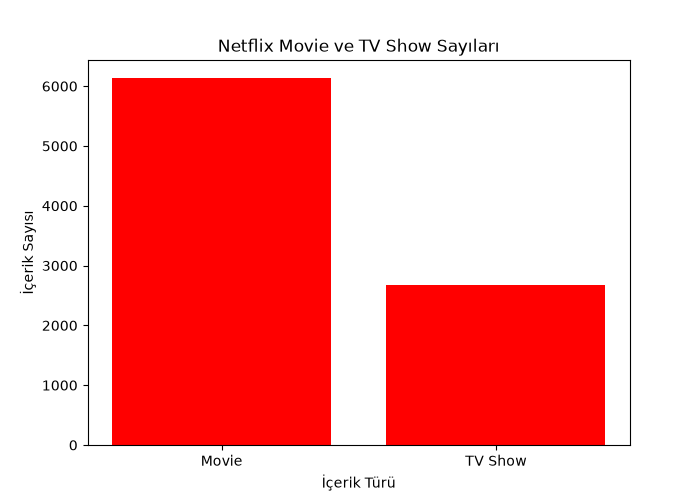
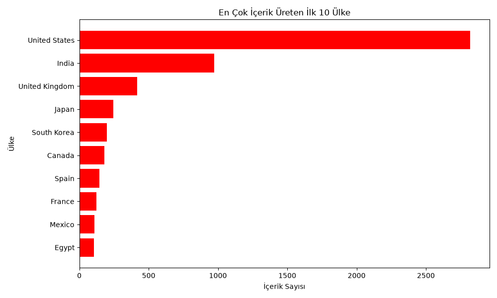
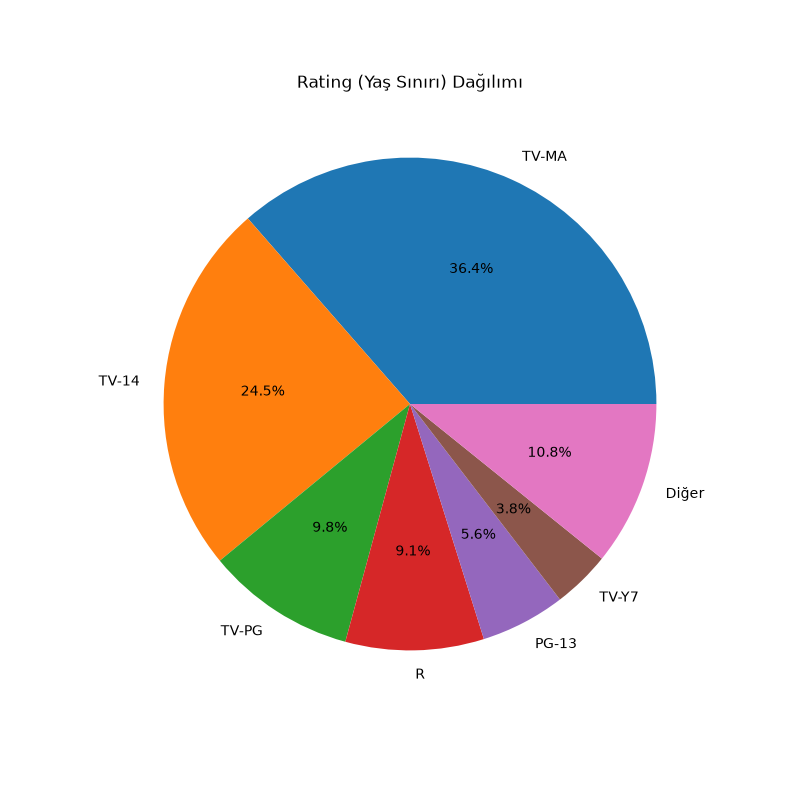
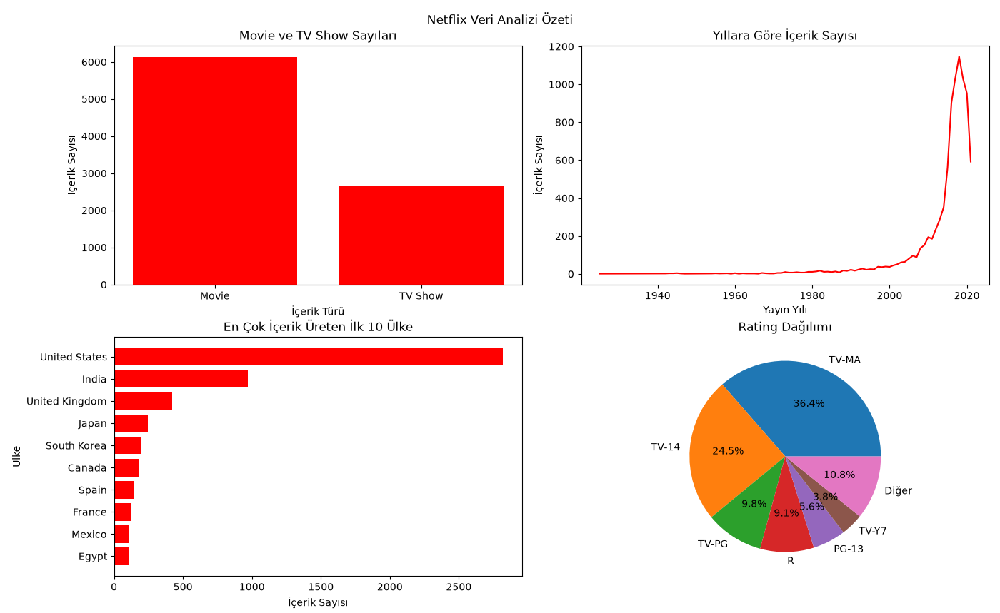

# Netflix Veri Analizi

Netflix katalog veri seti üzerinde **NumPy**, **Pandas** ve **Matplotlib** ile yapılmış keşifsel veri analizi (EDA) çalışması.

2021 yılına kadar Netflix'te yayınlanmış **8.807 film ve dizi** incelenerek katalogun nasıl bir profile sahip olduğu araştırıldı: ne kadar güncel olduğu, hangi ülkelerde üretildiği, hangi türlerin öne çıktığı ve hangi yaş grubunu hedeflediği.

---

## Veri Kaynağı

**Netflix Movies and TV Shows** — Kaggle
https://www.kaggle.com/datasets/shivamb/netflix-shows

Veri seti 8.807 satır ve 12 sütundan oluşur:

| Sütun | Açıklama |
|---|---|
| `show_id` | Her içerik için benzersiz kimlik |
| `type` | İçerik türü — Movie veya TV Show |
| `title` | İçeriğin adı |
| `director` | Yönetmen (dizilerde çoğunlukla boş) |
| `cast` | Oyuncu kadrosu |
| `country` | Yapım ülkesi/ülkeleri |
| `date_added` | Netflix'e eklenme tarihi |
| `release_year` | Orijinal yayın yılı |
| `rating` | Yaş sınırı (TV-MA, TV-14, PG-13 …) |
| `duration` | Süre — filmlerde dakika, dizilerde sezon |
| `listed_in` | Kategori/tür etiketleri |
| `description` | Kısa özet |

---

## Kullanılan Teknolojiler

- **Python 3**
- **NumPy** — yayın yılı üzerinde istatistiksel hesaplamalar, boolean indeksleme, histogram
- **Pandas** — filtreleme, gruplama, `value_counts`, `explode`, eksik veri analizi
- **Matplotlib** — bar, çizgi, yatay bar, pasta grafikleri ve 2x2 özet panosu

## Kurulum ve Çalıştırma

```bash
pip install numpy pandas matplotlib
py netflix_veri_analizi.py
```

`netflix_titles.csv` dosyası betikle aynı klasörde olmalıdır. Analiz sonuçları terminale yazdırılır, grafikler ise sırayla ayrı pencerelerde açılır — devam etmek için pencereyi kapatmak yeterlidir.

---

## Analiz Adımları

**Bölüm 1 — Yayın yılı istatistikleri (NumPy)**
Ortalama, medyan, standart sapma ve uç değerler; 2015 sonrası içeriğin payı; on yıllık dönemlere göre histogram dağılımı.

**Bölüm 2 — Katalog yapısı (Pandas)**
Eksik veri kontrolü, film/dizi kompozisyonu, ülkelere göre üretim, kategori dağılımı (çoklu etiketler `explode` ile ayrıştırılarak), yıllara göre üretim hacmi ve film sürelerinin sayısallaştırılması.

**Bölüm 3 — Görselleştirme (Matplotlib)**
Beş grafikle bulguların görselleştirilmesi.

---

## Grafikler

### Katalogun film / dizi dağılımı



Katalogun yaklaşık %70'i film: 6.131 filme karşılık 2.676 dizi bulunuyor.

### Yıllara göre içerik sayısı


2000'lere kadar neredeyse düz seyreden eğri, 2015 sonrasında sert bir yükselişe geçip 2018'de zirve yapıyor. Son yıllardaki düşüş gerçek bir daralma değil — veri seti 2021'de toplandığı için o dönem eksik kalıyor.

### En çok içerik üreten ilk 10 ülke



ABD 2.800'ü aşkın içerikle listeyi domine ediyor; ikinci sıradaki Hindistan'ın yaklaşık üç katı. Güney Kore ve Japonya'nın ilk beşte yer alması, Asya içeriğine yapılan yatırımı gösteriyor.

### Yaş sınırı (rating) dağılımı



TV-MA (%36,4) ve TV-14 (%24,5) birlikte katalogun %60'ından fazlasını oluşturuyor. Netflix ağırlıklı olarak yetişkin ve genç yetişkin izleyiciyi hedefliyor; çocuk içeriği (TV-Y7) %3,8'de kalıyor.

### Özet pano



Dört bulgunun tek karede birleşimi.

---

## Öne Çıkan Bulgular

| Bulgu | Değer |
|---|---|
| Toplam içerik | 8.807 |
| Film / Dizi | 6.131 / 2.676 (%70 film) |
| En üretken yıl | 2018 — 1.147 içerik |
| 2015 sonrası içerik | 5.656 (%64,2) |
| Ortalama yayın yılı | 2014,18 (medyan 2017) |
| Lider ülke | ABD, 2.800+ içerik |
| En popüler kategori | International Movies |
| Baskın yaş sınırı | TV-MA + TV-14 = %60,9 |
| Ortalama film süresi | 99,6 dakika |
| En uzun yapım | *Black Mirror: Bandersnatch* — 312 dakika |

**Genel değerlendirme:** Netflix katalogu ABD merkezli, 2015 sonrası hızla büyümüş, film ağırlıklı ve yetişkin izleyiciyi hedefleyen bir içerik kütüphanesi. Ortalama yayın yılının medyandan düşük olması dağılımın sola çarpık olduğunu, yani az sayıdaki eski klasiğin geniş bir güncel içerik kütlesi içinde yer aldığını gösteriyor.

---

## Notlar ve Sınırlamalar

- `country` sütununda ortak yapımlar `"United States, India"` gibi tek bir metin olarak tutulur. Ülke sıralamasında bu kombinasyonlar ayrı kategori sayılır; ülke bazında kesin toplam için sütunun ayrıştırılması gerekir.
- `director` sütunundaki yüksek eksik veri oranı hatalı veriden değil, dizilerde tek bir yönetmen belirtilmemesinden kaynaklanır.
- Süre analizi yalnızca filmleri kapsar; dizilerde `duration` alanı sezon sayısı tutar.
- Veri seti 2021'de toplanmıştır, sonraki içerikleri kapsamaz.
